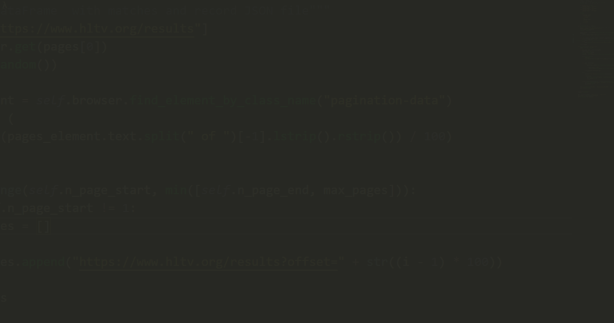

# CS:GO BestOf3 [HLTV.org](https://www.hltv.org/)
[](https://www.selenium.dev/documentation/en/selenium_installation/installing_selenium_libraries/) [](https://pandas.pydata.org/) [](https://numpy.org/)

### 🗡 Python Web Scraping Project 🔫

[Kaggle Dataset](https://www.kaggle.com/viniciusromanosilva/csgo-hltv)

### How to Run 🏁
**1. Create a virtual environment**

**2. Install de Dependences**
```
$ pip install -r requirements.txt
```
**3. Run**
```
$ python csgo_hltv\main.py
```


### How to Read the Results 📖
```python
>>> from csgo_hltv.helpers import read_datacs
>>> df = read_datacs()
```

### Test 🚧
```
$ pytest csgo_hltv\
```
